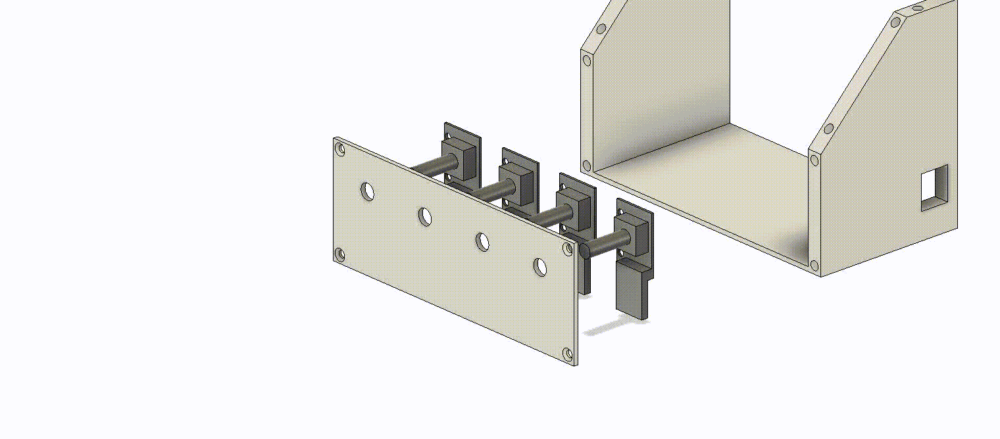
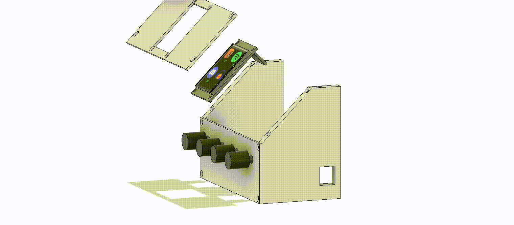
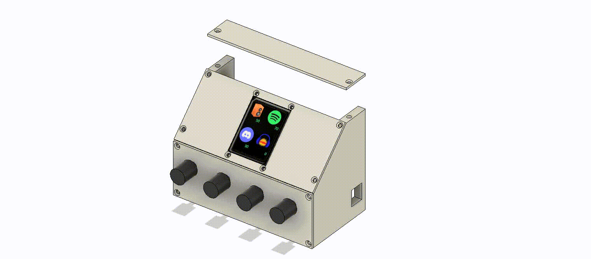
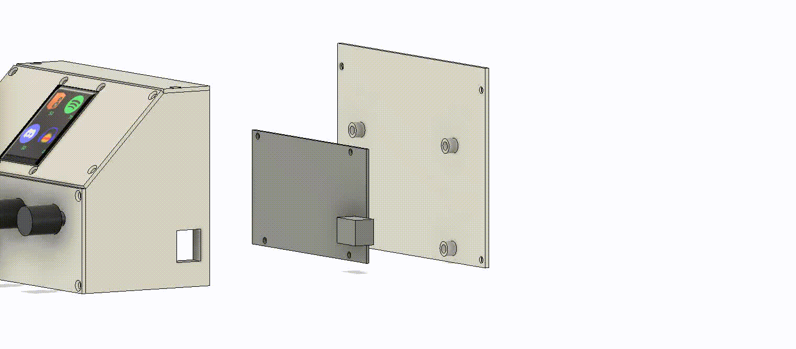

# Assembly

Before starting assembly, make sure you have the [electronics working and wires attached](../firmware/WIRING.md).

## Option A: 3D print
1. 3D print one of each STL file found in this folder
2. Insert [M3 heat inserts](https://uk.rs-online.com/web/p/threaded-inserts/0278534) into each hole on the body and the back piece
3. Insert the encoders into the front piece, secure each with nuts, attach the knobs and then attach to the body 
4. Insert the screen into the screen piece, then attach to the body 
5. Attach the top piece to the body 
6. Attach the arduino to the back piece, then attach to the body 

## Option B: 2D cut
Coming soon
