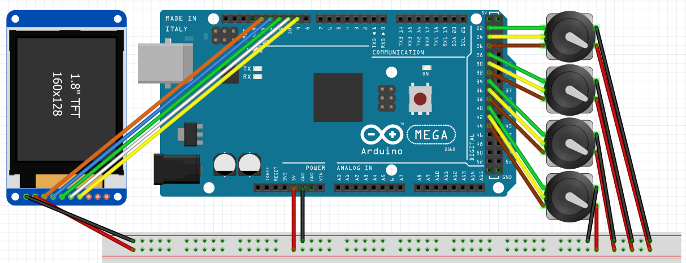

# Wiring

## Display
- VCC = 5V
- GND = GND
- CLK/SCK = 13
- MOSI/SDA = 12
- CS = 11
- DC = 10
- RST = 9

8th Pin unconnected.

## Rotary encoders
- VCC/+ = 5V
- GND = GND

Master volume:
- SW = 22
- DT = 24
- CLK = 26

App 1:
- SW = 28
- DT = 30
- CLK = 32

App 2:
- SW = 34
- DT = 36
- CLK = 38

App 3:
- SW = 40
- DT = 42
- CLK = 44
